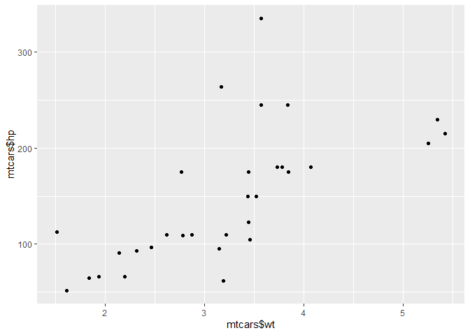

## Relational operators


```r
# Comparison of logicals
TRUE == FALSE
```

```
## [1] FALSE
```

```r
# Comparison of numerics
-6*14 != 17 - 101
```

```
## [1] FALSE
```

```r
# Comparison of character strings
"useR" == "user"
```

```
## [1] FALSE
```

```r
# Compare a logical with a numeric
TRUE == 1
```

```
## [1] TRUE
```

```r
# Comparison of numerics
-6 * 5 + 2 >= -10 + 1
```

```
## [1] FALSE
```

```r
# Comparison of character strings
"raining" <= "raining dogs"
```

```
## [1] TRUE
```

```r
# Comparison of logicals
TRUE > FALSE
```

```
## [1] TRUE
```

```r
# The linkedin and facebook vectors have already been created for you
linkedin <- c(16, 9, 13, 5, 2, 17, 14)
facebook <- c(17, 7, 5, 16, 8, 13, 14)

# Popular days
linkedin > 15
```

```
## [1]  TRUE FALSE FALSE FALSE FALSE  TRUE FALSE
```

```r
# Quiet days
linkedin <= 5
```

```
## [1] FALSE FALSE FALSE  TRUE  TRUE FALSE FALSE
```

```r
# LinkedIn more popular than Facebook
linkedin > facebook
```

```
## [1] FALSE  TRUE  TRUE FALSE FALSE  TRUE FALSE
```

## comparing matrices


```r
# The social data has been created for you
linkedin <- c(16, 9, 13, 5, 2, 17, 14)
facebook <- c(17, 7, 5, 16, 8, 13, 14)
views <- matrix(c(linkedin, facebook), nrow = 2, byrow = TRUE)

# When does views equal 13?
views == 13
```

```
##       [,1]  [,2]  [,3]  [,4]  [,5]  [,6]  [,7]
## [1,] FALSE FALSE  TRUE FALSE FALSE FALSE FALSE
## [2,] FALSE FALSE FALSE FALSE FALSE  TRUE FALSE
```

```r
# When is views less than or equal to 14?
views <= 14
```

```
##       [,1] [,2] [,3]  [,4] [,5]  [,6] [,7]
## [1,] FALSE TRUE TRUE  TRUE TRUE FALSE TRUE
## [2,] FALSE TRUE TRUE FALSE TRUE  TRUE TRUE
```

## Logical operators

## & and |


```r
# The linkedin and last variable are already defined for you
linkedin <- c(16, 9, 13, 5, 2, 17, 14)
last <- tail(linkedin, 1)

# Is last under 5 or above 10?
last < 5 | last > 10
```

```
## [1] TRUE
```

```r
# Is last between 15 (exclusive) and 20 (inclusive)?
15 < last & last <= 20
```

```
## [1] FALSE
```

```r
# The social data (linkedin, facebook, views) has been created for you

# linkedin exceeds 10 but facebook below 10
linkedin > 10 & facebook < 10
```

```
## [1] FALSE FALSE  TRUE FALSE FALSE FALSE FALSE
```

```r
# When were one or both visited at least 12 times?
linkedin >= 12 | facebook >= 12
```

```
## [1]  TRUE FALSE  TRUE  TRUE FALSE  TRUE  TRUE
```

```r
# When is views between 11 (exclusive) and 14 (inclusive)?
views > 11 & views <= 14
```

```
##       [,1]  [,2]  [,3]  [,4]  [,5]  [,6] [,7]
## [1,] FALSE FALSE  TRUE FALSE FALSE FALSE TRUE
## [2,] FALSE FALSE FALSE FALSE FALSE  TRUE TRUE
```

## Blend it all together


```r
# li_df is pre-loaded in your workspace

# Select the second column, named day2, from li_df: second
second <- li_df[, "day2"]

# Build a logical vector, TRUE if value in second is extreme: extremes
extremes <- second > 25 | second <5

# Count the number of TRUEs in extremes
sum(extremes)
```

## Conditonal statements

## if statement

```r
# Variables related to your last day of recordings
medium <- "LinkedIn"
num_views <- 14

# Examine the if statement for medium
if (medium == "LinkedIn") {
  print("Showing LinkedIn information")
}
```

```
## [1] "Showing LinkedIn information"
```

```r
# Write the if statement for num_views
if (num_views > 15){print("You are popular!")}
```

## add an else


```r
# Variables related to your last day of recordings
medium <- "LinkedIn"
num_views <- 14

# Control structure for medium
if (medium == "LinkedIn") {
  print("Showing LinkedIn information")
} else {
  print("Unknown medium")
}
```

```
## [1] "Showing LinkedIn information"
```

```r
# Control structure for num_views
if (num_views > 15) {
  print("You're popular!")
} else {
  print("Try to be more visible!")
}
```

```
## [1] "Try to be more visible!"
```

## further customize: else if


```r
# Variables related to your last day of recordings
medium <- "LinkedIn"
num_views <- 14

# Control structure for medium
if (medium == "LinkedIn") {
  print("Showing LinkedIn information")
} else if (medium == "Facebook") {
  # Add code to print correct string when condition is TRUE
  print("Showing Facebook information")
} else {
  print("Unknown medium")
}
```

```
## [1] "Showing LinkedIn information"
```

```r
# Control structure for num_views
if (num_views > 15) {
  print("You're popular!")
} else if (num_views <= 15 & num_views > 10) {
  # Add code to print correct string when condition is TRUE
  print("Your number of views is average")
} else {
  print("Try to be more visible!")
}
```

```
## [1] "Your number of views is average"
```

## Take control!


```r
# Variables related to your last day of recordings
li <- 15
fb <- 9

# Code the control-flow construct
if (li >= 15 & fb >= 15) {
  sms <- 2 * (li + fb)
} else if (li < 10 & fb < 10) {
  sms <- 0.5 * (li + fb)
} else {
  sms <- li + fb
}

# Print the resulting sms to the console
sms
```

```
## [1] 24
```

## while loop

## write a while loop


```r
# Initialize the speed variable
speed <- 64

# Code the while loop
while (speed > 30) {
  print("Slow down!")
  speed <- speed - 7
}
```

```
## [1] "Slow down!"
## [1] "Slow down!"
## [1] "Slow down!"
## [1] "Slow down!"
## [1] "Slow down!"
```

```r
# Print out the speed variable
speed
```

```
## [1] 29
```

## Throw in more conditionals


```r
# Initialize the speed variable
speed <- 64

# Extend/adapt the while loop
while (speed > 30) {
  print(paste("Your speed is",speed))
  if (speed > 48) {
    print("Slow down big time!")
    speed = speed - 11
  } else {
    print("Slow down!")
    speed = speed - 6
  }
}
```

```
## [1] "Your speed is 64"
## [1] "Slow down big time!"
## [1] "Your speed is 53"
## [1] "Slow down big time!"
## [1] "Your speed is 42"
## [1] "Slow down!"
## [1] "Your speed is 36"
## [1] "Slow down!"
```

## Stop the while loop: break


```r
# Initialize the speed variable
speed <- 88

while (speed > 30) {
  print(paste("Your speed is", speed))
  
  # Break the while loop when speed exceeds 80
  if (speed > 80) {
  break
  }
  
  if (speed > 48) {
    print("Slow down big time!")
    speed <- speed - 11
  } else {
    print("Slow down!")
    speed <- speed - 6
  }
}
```

```
## [1] "Your speed is 88"
```

## Build a while loop from scratch


```r
# Initialize i as 1 
i <- 1

# Code the while loop
while (i <= 10) {
  print(3*i)
  if (i %% 8 == 0) {
    break
    print(3*i)
  }
  i <- i + 1
}
```

```
## [1] 3
## [1] 6
## [1] 9
## [1] 12
## [1] 15
## [1] 18
## [1] 21
## [1] 24
```

## The for loop

## Loop over a vector


```r
# The linkedin vector has already been defined for you
linkedin <- c(16, 9, 13, 5, 2, 17, 14)

# Loop version 1
for (x in linkedin){
    print(x)
}
```

```
## [1] 16
## [1] 9
## [1] 13
## [1] 5
## [1] 2
## [1] 17
## [1] 14
```

```r
# Loop version 2
for (i in 1: length(linkedin)){
    print(linkedin[i])
}
```

```
## [1] 16
## [1] 9
## [1] 13
## [1] 5
## [1] 2
## [1] 17
## [1] 14
```

## Loop over a list


```r
# The nyc list is already specified
nyc <- list(pop = 8405837, 
            boroughs = c("Manhattan", "Bronx", "Brooklyn", "Queens", "Staten Island"), 
            capital = FALSE)

# Loop version 1
for (x in nyc){
    print(x)
}
```

```
## [1] 8405837
## [1] "Manhattan"     "Bronx"         "Brooklyn"      "Queens"       
## [5] "Staten Island"
## [1] FALSE
```

```r
# Loop version 2
for (i in 1: length(nyc)){
    print(nyc[[i]]) # notice the double square brackets
}
```

```
## [1] 8405837
## [1] "Manhattan"     "Bronx"         "Brooklyn"      "Queens"       
## [5] "Staten Island"
## [1] FALSE
```

## Loop over a matrix


```r
# Define the tic-tac-toe matrix ttt 
ttt<-matrix(c("O",  NA,   "X", NA,  "O",  "O", "X",  NA,   "X" ), 
            byrow = T, nrow = 3);ttt
```

```
##      [,1] [,2] [,3]
## [1,] "O"  NA   "X" 
## [2,] NA   "O"  "O" 
## [3,] "X"  NA   "X"
```

```r
# define the double for loop
for (i in 1: nrow(ttt)) {
  for (j in 1: ncol(ttt)) {
    print(paste("On row", i, "and column", j, "the board contains", ttt[i,j]))
  }
}
```

```
## [1] "On row 1 and column 1 the board contains O"
## [1] "On row 1 and column 2 the board contains NA"
## [1] "On row 1 and column 3 the board contains X"
## [1] "On row 2 and column 1 the board contains NA"
## [1] "On row 2 and column 2 the board contains O"
## [1] "On row 2 and column 3 the board contains O"
## [1] "On row 3 and column 1 the board contains X"
## [1] "On row 3 and column 2 the board contains NA"
## [1] "On row 3 and column 3 the board contains X"
```

## Mix it up with control flow


```r
# The linkedin vector has already been defined for you
linkedin <- c(16, 9, 13, 5, 2, 17, 14)

# Code the for loop with conditionals
for (li in linkedin) {
  if (li > 10) {
    print("You're popular!")    
  } else {
    print("Be more visible!")
  }
  print(li)
}
```

```
## [1] "You're popular!"
## [1] 16
## [1] "Be more visible!"
## [1] 9
## [1] "You're popular!"
## [1] 13
## [1] "Be more visible!"
## [1] 5
## [1] "Be more visible!"
## [1] 2
## [1] "You're popular!"
## [1] 17
## [1] "You're popular!"
## [1] 14
```

## Next, you break it


```r
# The linkedin vector has already been defined for you
linkedin <- c(16, 9, 13, 5, 2, 17, 14)

# Adapt/extend the for loop
for (li in linkedin) {
  if (li > 10) {
    print("You're popular!")
  } else {
    print("Be more visible!")
  }
  
  # Add if statement with break
  if (li > 16){
    print("This is ridiculous, I'm outta here!")
    break
  }
  
  
  # Add if statement with next
  if (li < 5){
    print("This is too embarrassing!")
    next
  }
  

  print(li)
}
```

```
## [1] "You're popular!"
## [1] 16
## [1] "Be more visible!"
## [1] 9
## [1] "You're popular!"
## [1] 13
## [1] "Be more visible!"
## [1] 5
## [1] "Be more visible!"
## [1] "This is too embarrassing!"
## [1] "You're popular!"
## [1] "This is ridiculous, I'm outta here!"
```

```r
# notice that "break" and "next" have to be inside the expression of the for loop
```

## Build a for loop from scratch

This exercise will not introduce any new concepts on for loops.

We already went ahead and defined a variable rquote. This variable has been split up into a vector that contains separate letters and has been stored in a vector chars with the strsplit() function.

Can you write code that counts the number of r's that come before the first u in rquote?


```r
# Pre-defined variables
rquote <- "r's internals are irrefutably intriguing"
chars <- strsplit(rquote, split = "")[[1]]

# Initialize rcount
rcount <- 0

# Finish the for loop
for (char in chars) {
    if (char == "r"){
        rcount = rcount + 1
    }else if (char == "u"){
        break
    }  
  
}

# Print out rcount
print(rcount)
```

```
## [1] 5
```

## Introduction to Functions

## Function documentation

```r
# Consult the documentation on the mean() function
# ?mean

# Inspect the arguments of the mean() function
args(mean)
```

```
## function (x, ...) 
## NULL
```


## Use a function
Check the documentation on the `mean()` function again:

`?mean`

The Usage section of the documentation includes two versions of the `mean()` function. The first usage,

`mean(x, ...)`

is the most general usage of the mean function. The `'Default S3 method',` however, is:

`mean(x, trim = 0, na.rm = FALSE, ...)`

The `...` is called the ellipsis. It is a way for R to pass arguments along without the function having to name them explicitly. The ellipsis will be treated in more detail in future courses.

For the remainder of this exercise, just work with the second usage of the mean function. Notice that both trim and na.rm have default values. This makes them optional arguments.

```r
# The linkedin and facebook vectors have already been created for you
linkedin <- c(16, 9, 13, 5, 2, 17, 14)
facebook <- c(17, 7, 5, 16, 8, 13, 14)

# Calculate the mean of the sum
avg_sum <- mean(linkedin + facebook)

# Calculate the trimmed mean of the sum
avg_sum_trimmed <- mean(linkedin + facebook, trim = 0.2)

# Inspect both new variables
avg_sum
```

```
## [1] 22.28571
```

```r
avg_sum_trimmed
```

```
## [1] 22.6
```

## Nested functions


```r
# The linkedin and facebook vectors have already been created for you
linkedin <- c(16, 9, 13, 5, NA, 17, 14)
facebook <- c(17, NA, 5, 16, 8, 13, 14)

# Calculate the mean absolute deviation
mean(abs(linkedin - facebook), na.rm = T)
```

```
## [1] 4.8
```

## Writing functions

Using `return()` inside an `if` statement is a bit like using `break` inside an `if` statement. 

There are situations in which your function does not require an input. Let's say you want to write a function that gives us the random outcome of throwing a fair die:


```r
set.seed(528)

throw_die <- function() {
  number <- sample(1:6, size = 1)
  number
}

throw_die()
```

```
## [1] 3
```

code a function that doesn't take any arguments


```r
# Define the function hello()
hello <- function(){
    print("Hi there!")
    return(TRUE)
}

# Call the function hello()
hello()
```

```
## [1] "Hi there!"
```

```
## [1] TRUE
```

## A function with default arguments


```r
# Finish the pow_two() function
pow_two <- function(x, print_info = TRUE) {
  y <- x ^ 2
  if (print_info == TRUE) {
    print(paste(x, "to the power two equals", y))
    }
  return(y)
}

pow_two(3)
```

```
## [1] "3 to the power two equals 9"
```

```
## [1] 9
```

```r
pow_two(3, print_info = FALSE)
```

```
## [1] 9
```

## Function scoping

Whatever variable defined inside the function is not available to call from outside the function.

## A more advanced function


```r
# Back to the linkedin and facebook vectors 

# Define the interpret function
interpret <- function(num_views) {
  if (num_views > 15) {
    print("You're popular!")
    return(num_views)
  } else {
    print("Try to be more visible!")
    return(0)
  }
}

# Call the interpret function twice
linkedin <- linkedin[complete.cases(linkedin)]
facebook <- facebook[complete.cases(facebook)]
interpret(linkedin[1])
```

```
## [1] "You're popular!"
```

```
## [1] 16
```

```r
interpret(facebook[2])
```

```
## [1] "Try to be more visible!"
```

```
## [1] 0
```

## Still more advanced


```r
# The linkedin and facebook vectors have already been created for you
linkedin <- c(16, 9, 13, 5, 2, 17, 14)
facebook <- c(17, 7, 5, 16, 8, 13, 14)

# The interpret() can be used inside interpret_all()
interpret <- function(num_views) {
  if (num_views > 15) {
    print("You're popular!")
    return(num_views)
  } else {
    print("Try to be more visible!")
    return(0)
  }
}

# Define the interpret_all() function
# views: vector with data to interpret
# return_sum: return total number of views on popular days?
interpret_all <- function(views, return_sum = TRUE) {
  count <- 0

  for (v in views) {
    count = count + interpret(v)
  }

  if (return_sum == TRUE) {
    return(count)
  } else {
    return(NULL)
  }
}

# Call the interpret_all() function on both linkedin and facebook
interpret_all(linkedin)
```

```
## [1] "You're popular!"
## [1] "Try to be more visible!"
## [1] "Try to be more visible!"
## [1] "Try to be more visible!"
## [1] "Try to be more visible!"
## [1] "You're popular!"
## [1] "Try to be more visible!"
```

```
## [1] 33
```

```r
interpret_all(facebook)
```

```
## [1] "You're popular!"
## [1] "Try to be more visible!"
## [1] "Try to be more visible!"
## [1] "You're popular!"
## [1] "Try to be more visible!"
## [1] "Try to be more visible!"
## [1] "Try to be more visible!"
```

```
## [1] 33
```

## R packages


```r
# look at the currently attached packages 
search()
```

```
## [1] ".GlobalEnv"        "package:stats"     "package:graphics" 
## [4] "package:grDevices" "package:utils"     "package:datasets" 
## [7] "package:methods"   "Autoloads"         "package:base"
```

```r
# Load the ggplot2 package
library(ggplot2)

# Retry the qplot() function
qplot(mtcars$wt, mtcars$hp)
```

<!-- -->

```r
# Check out the currently attached packages again
search()
```

```
##  [1] ".GlobalEnv"        "package:ggplot2"   "package:stats"    
##  [4] "package:graphics"  "package:grDevices" "package:utils"    
##  [7] "package:datasets"  "package:methods"   "Autoloads"        
## [10] "package:base"
```

## The apply family

## lapply()

## Use lapply with a built-in R function


```r
# The vector pioneers has already been created for you
pioneers <- c("GAUSS:1777", "BAYES:1702", "PASCAL:1623", "PEARSON:1857")

# Split names from birth year
split_math <- strsplit(pioneers, split = ":")

# Convert to lowercase strings: split_low
split_low <- lapply(split_math, tolower)

# Take a look at the structure of split_low
str(split_low)
```

```
## List of 4
##  $ : chr [1:2] "gauss" "1777"
##  $ : chr [1:2] "bayes" "1702"
##  $ : chr [1:2] "pascal" "1623"
##  $ : chr [1:2] "pearson" "1857"
```

## Use lapply with your own function


```r
# Code from previous exercise:
pioneers <- c("GAUSS:1777", "BAYES:1702", "PASCAL:1623", "PEARSON:1857")
split <- strsplit(pioneers, split = ":")
split_low <- lapply(split, tolower)

# Write function select_first()
select_first <- function(x) {
  x[1]
}

# Apply select_first() over split_low: names
names <- lapply(split_low, select_first)

# Write function select_second()
select_second <- function(x) {
  x[2]
}

# Apply select_second() over split_low: years
years <- lapply(split_low, select_second)
```

## lapply and anonymous functions


```r
# split_low has been created for you
split_low
```

```
## [[1]]
## [1] "gauss" "1777" 
## 
## [[2]]
## [1] "bayes" "1702" 
## 
## [[3]]
## [1] "pascal" "1623"  
## 
## [[4]]
## [1] "pearson" "1857"
```

```r
# Transform: use anonymous function inside lapply
names <- lapply(split_low, function(x) {x[1]})

# Transform: use anonymous function inside lapply
years <- lapply(split_low, function(x) {x[2]})
```

## Use lapply with additional arguments


```r
# Definition of split_low
pioneers <- c("GAUSS:1777", "BAYES:1702", "PASCAL:1623", "PEARSON:1857")
split <- strsplit(pioneers, split = ":")
split_low <- lapply(split, tolower)

# Generic select function
select_el <- function(x, index) {
  x[index]
}

# Use lapply() twice on split_low: names and years
names <- lapply(split_low, select_el, index = 1)
years <- lapply(split_low, select_el, index = 2)
```

## Apply functions that return NULL

In all of the previous exercises, it was assumed that the functions that were applied over vectors and lists actually returned a meaningful result. For example, the `tolower()` function simply returns the strings with the characters in lowercase. This won't always be the case. Suppose you want to display the structure of every element of a list. You could use the `str()` function for this, which returns `NULL`:


```r
lapply(list(1, "a", TRUE), str)
```

```
##  num 1
##  chr "a"
##  logi TRUE
```

```
## [[1]]
## NULL
## 
## [[2]]
## NULL
## 
## [[3]]
## NULL
```

This call actually returns a list, the same size as the input list, containing all `NULL` values. On the other hand calling


```r
str(TRUE)
```

```
##  logi TRUE
```

on its own prints only the structure of the logical to the console, not `NULL`. That's because `str()` uses `invisible()` behind the scenes, which returns an invisible copy of the return value, `NULL` in this case. This prevents it from being printed when the result of `str()` is not assigned.

What will the following code chunk return? Try to reason about the result before executing!

```r
lapply(split_low, function(x) {
  if (nchar(x[1]) > 5) {
    return(NULL)
  } else {
    return(x[2])
  }
})
```

```
## [[1]]
## [1] "1777"
## 
## [[2]]
## [1] "1702"
## 
## [[3]]
## NULL
## 
## [[4]]
## NULL
```

## sapply

- short for "simplify / simplified apply"

- `sapply(cities, nchar, USE.NAMES = FALSE)` removes city names from the output.

- usually , the output of `sapply` is a vector. However, it will return a list if the simplification is not possible.  in this case, we can consider using `vapply`

## How to use sapply


```r
# Define temperature dataset
temp <- list(c(3, 7, 9, 6, -1), c(6, 9, 12, 13, 5), c(4, 8, 3, -1, -3
), c(1, 4, 7, 2, -2), c(5, 7, 9, 4, 2), c(-3, 5, 8, 9, 4), c(3, 
6, 9, 4, 1))


# Use lapply() to find each day's minimum temperature
lapply(temp, min)
```

```
## [[1]]
## [1] -1
## 
## [[2]]
## [1] 5
## 
## [[3]]
## [1] -3
## 
## [[4]]
## [1] -2
## 
## [[5]]
## [1] 2
## 
## [[6]]
## [1] -3
## 
## [[7]]
## [1] 1
```

```r
# Use sapply() to find each day's minimum temperature
sapply(temp, min)
```

```
## [1] -1  5 -3 -2  2 -3  1
```

```r
# Use lapply() to find each day's maximum temperature
lapply(temp, max)
```

```
## [[1]]
## [1] 9
## 
## [[2]]
## [1] 13
## 
## [[3]]
## [1] 8
## 
## [[4]]
## [1] 7
## 
## [[5]]
## [1] 9
## 
## [[6]]
## [1] 9
## 
## [[7]]
## [1] 9
```

```r
# Use sapply() to find each day's maximum temperature
sapply(temp, max)
```

```
## [1]  9 13  8  7  9  9  9
```

## sapply with your own function


```r
# Finish function definition of extremes_avg
extremes_avg <- function(x) {
  ( min(x) + max(x) ) / 2
}

# Apply extremes_avg() over temp using sapply()
sapply(temp, extremes_avg)
```

```
## [1] 4.0 9.0 2.5 2.5 5.5 3.0 5.0
```

```r
# Apply extremes_avg() over temp using lapply()
lapply(temp, extremes_avg)
```

```
## [[1]]
## [1] 4
## 
## [[2]]
## [1] 9
## 
## [[3]]
## [1] 2.5
## 
## [[4]]
## [1] 2.5
## 
## [[5]]
## [1] 5.5
## 
## [[6]]
## [1] 3
## 
## [[7]]
## [1] 5
```

## sapply with function returning vector


```r
# Create a function that returns min and max of a vector: extremes
extremes <- function(x) {
  c(min = min(x), max = max(x))
}

# Apply extremes() over temp with sapply()
sapply(temp, extremes)
```

```
##     [,1] [,2] [,3] [,4] [,5] [,6] [,7]
## min   -1    5   -3   -2    2   -3    1
## max    9   13    8    7    9    9    9
```

```r
# Apply extremes() over temp with lapply()
lapply(temp, extremes)
```

```
## [[1]]
## min max 
##  -1   9 
## 
## [[2]]
## min max 
##   5  13 
## 
## [[3]]
## min max 
##  -3   8 
## 
## [[4]]
## min max 
##  -2   7 
## 
## [[5]]
## min max 
##   2   9 
## 
## [[6]]
## min max 
##  -3   9 
## 
## [[7]]
## min max 
##   1   9
```

## sapply can't simplify, now what?


```r
# Definition of below_zero()
below_zero <- function(x) {
  return(x[x < 0])
}

# Apply below_zero over temp using sapply(): freezing_s
freezing_s <- sapply(temp, below_zero)

# Apply below_zero over temp using lapply(): freezing_l
freezing_l <- lapply(temp, below_zero)

# Are freezing_s and freezing_l identical?
identical(freezing_s, freezing_l)
```

```
## [1] TRUE
```

Note: Given that the length of the output of `below_zero()` changes for different input vectors, `sapply()` is not able to nicely convert the output of `lapply()` to a nicely formatted matrix. Instead, the output values of `sapply()` and `lapply()` are exactly the same, as shown by the TRUE output of `identical()`.

## sapply with functions that return NULL


```r
# temp is already available in the workspace

# Definition of print_info()
print_info <- function(x) {
  cat("The average temperature is", mean(x), "\n")
}

# Apply print_info() over temp using sapply()
sapply(temp, print_info)
```

```
## The average temperature is 4.8 
## The average temperature is 9 
## The average temperature is 2.2 
## The average temperature is 2.4 
## The average temperature is 5.4 
## The average temperature is 4.6 
## The average temperature is 4.6
```

```
## [[1]]
## NULL
## 
## [[2]]
## NULL
## 
## [[3]]
## NULL
## 
## [[4]]
## NULL
## 
## [[5]]
## NULL
## 
## [[6]]
## NULL
## 
## [[7]]
## NULL
```

```r
# Apply print_info() over temp using lapply()
lapply(temp, print_info)
```

```
## The average temperature is 4.8 
## The average temperature is 9 
## The average temperature is 2.2 
## The average temperature is 2.4 
## The average temperature is 5.4 
## The average temperature is 4.6 
## The average temperature is 4.6
```

```
## [[1]]
## NULL
## 
## [[2]]
## NULL
## 
## [[3]]
## NULL
## 
## [[4]]
## NULL
## 
## [[5]]
## NULL
## 
## [[6]]
## NULL
## 
## [[7]]
## NULL
```

Note: Notice here that, quite surprisingly, sapply() does not simplify the list of `NULL's`. That's because the 'vector-version' of a list of `NULL's` would simply be a `NULL`, which is no longer a vector with the same length as the input. Proceed to the next exercise.

## Reverse engineering sapply

Imagine the output of the following code before executing.


```r
sapply(list(runif (10), runif (10)), 
       function(x) c(min = min(x), mean = mean(x), max = max(x)))
```

```
##            [,1]       [,2]
## min  0.03935214 0.05259505
## mean 0.53792598 0.44875058
## max  0.89194289 0.68974503
```

## vapply

## Use vapply


```r
# Definition of basics()
basics <- function(x) {
  c(min = min(x), mean = mean(x), max = max(x))
}

# Apply basics() over temp using vapply()
vapply(temp, basics, numeric(3))
```

```
##      [,1] [,2] [,3] [,4] [,5] [,6] [,7]
## min  -1.0    5 -3.0 -2.0  2.0 -3.0  1.0
## mean  4.8    9  2.2  2.4  5.4  4.6  4.6
## max   9.0   13  8.0  7.0  9.0  9.0  9.0
```

```r
# Definition of the basics() function
basics <- function(x) {
  c(min = min(x), mean = mean(x), median = median(x), max = max(x))
}

# Apply basics() over temp again using vapply()
vapply(temp, basics, numeric(4))
```

```
##        [,1] [,2] [,3] [,4] [,5] [,6] [,7]
## min    -1.0    5 -3.0 -2.0  2.0 -3.0  1.0
## mean    4.8    9  2.2  2.4  5.4  4.6  4.6
## median  6.0    9  3.0  2.0  5.0  5.0  4.0
## max     9.0   13  8.0  7.0  9.0  9.0  9.0
```

## From sapply to vapply


```r
sapply(temp, max)
```

```
## [1]  9 13  8  7  9  9  9
```

```r
sapply(temp, function(x, y) { mean(x) > y }, y = 5)
```

```
## [1] FALSE  TRUE FALSE FALSE  TRUE FALSE FALSE
```

```r
# Convert to vapply() expression
vapply(temp, max, numeric(1))
```

```
## [1]  9 13  8  7  9  9  9
```

```r
# Convert to vapply() expression
vapply(temp, function(x, y) { mean(x) > y }, y = 5, logical(1))
```

```
## [1] FALSE  TRUE FALSE FALSE  TRUE FALSE FALSE
```

## Useful Functions

## Mathematical utilities


```r
# The errors vector has already been defined for you
errors <- c(1.9, -2.6, 4.0, -9.5, -3.4, 7.3)

# Sum of absolute rounded values of errors
sum(abs(round(errors)))
```

```
## [1] 29
```

## Data Utilities


```r
# The linkedin and facebook lists have already been created for you
linkedin <- list(16, 9, 13, 5, 2, 17, 14)
facebook <- list(17, 7, 5, 16, 8, 13, 14)

# Convert linkedin and facebook to a vector: li_vec and fb_vec
li_vec<-unlist(linkedin)
fb_vec<-unlist(facebook)

# Append fb_vec to li_vec: social_vec
social_vec<-append(li_vec, fb_vec)

# Sort social_vec
sort(social_vec, decreasing = TRUE)
```

```
##  [1] 17 17 16 16 14 14 13 13  9  8  7  5  5  2
```

## Beat Gauss using R


```r
# Create first sequence: seq1
seq1 <- seq(1, 500, by = 3)

# Create second sequence: seq2
seq2 <- seq(1200, 900, by = -7)

# Calculate total sum of the sequences
sum(seq1, seq2)
```

```
## [1] 87029
```

## Regular Expressions

## grepl & grep


```r
# The emails vector has already been defined for you
emails <- c("john.doe@ivyleague.edu", "education@world.gov", "dalai.lama@peace.org",
            "invalid.edu", "quant@bigdatacollege.edu", "cookie.monster@sesame.tv")

# Use grepl() to match for "edu"
grepl(pattern = "edu", x = emails)
```

```
## [1]  TRUE  TRUE FALSE  TRUE  TRUE FALSE
```

```r
# Use grep() to match for "edu", save result to hits
hits <- grep(patter = "edu", x = emails)

# Subset emails using hits
emails[hits]
```

```
## [1] "john.doe@ivyleague.edu"   "education@world.gov"     
## [3] "invalid.edu"              "quant@bigdatacollege.edu"
```

## grepl & grep (2)


You can use the caret, `^`, and the dollar sign, `$` to match the content located in the start and end of a string, respectively. This could take us one step closer to a correct pattern for matching only the ".edu" email addresses from our list of emails. But there's more that can be added to make the pattern more robust:

- `@`, because a valid email must contain an at-sign.

- `.*`, which matches any character (.) zero or more times (*). Both the dot and the asterisk are metacharacters. You can use them to match any character between the at-sign and the ".edu" portion of an email address.

- `\\.edu$`, to match the ".edu" part of the email at the end of the string. The `\\` part escapes the dot: it tells R that you want to use the `.` as an actual character.


```r
# The emails vector has already been defined for you
emails <- c("john.doe@ivyleague.edu", "education@world.gov", "dalai.lama@peace.org",
            "invalid.edu", "quant@bigdatacollege.edu", "cookie.monster@sesame.tv")

# Use grepl() to match for .edu addresses more robustly
grepl(pattern = "@.*\\.edu$", x = emails)
```

```
## [1]  TRUE FALSE FALSE FALSE  TRUE FALSE
```

```r
# Use grep() to match for .edu addresses more robustly, save result to hits
hits <- grep(pattern = "@.*\\.edu$", x = emails)

# Subset emails using hits
emails[hits]
```

```
## [1] "john.doe@ivyleague.edu"   "quant@bigdatacollege.edu"
```

## sub & gsub

While `grep()` and `grepl()` were used to simply check whether a regular expression could be matched with a character vector, `sub()` and `gsub()` take it one step further: you can specify a replacement argument. If inside the character vector `x`, the regular expression `pattern` is found, the matching element(s) will be replaced with `replacement`. `sub()` only replaces the first match, whereas `gsub()` replaces all matches.


```r
# The emails vector has already been defined for you
emails <- c("john.doe@ivyleague.edu", "education@world.gov", "global@peace.org",
            "invalid.edu", "quant@bigdatacollege.edu", "cookie.monster@sesame.tv")

# Use sub() to convert the email domains to datacamp.edu
sub(pattern = "@.*\\.edu$", replacement = "@datacamp.edu", x = emails)
```

```
## [1] "john.doe@datacamp.edu"    "education@world.gov"     
## [3] "global@peace.org"         "invalid.edu"             
## [5] "quant@datacamp.edu"       "cookie.monster@sesame.tv"
```

## sub & gsub (2)

Regular expressions are a typical concept that you'll learn by doing and by seeing other examples. Before you rack your brains over the regular expression in this exercise, have a look at the new things that will be used:

- `.*`: A usual suspect! It can be read as "any character that is matched zero or more times".

- `\\s`: Match a space. The "s" is normally a character, escaping it (`\\`) makes it a metacharacter.

`[0-9]+`: Match the numbers 0 to 9, at least once (+).
`([0-9]+)`: The parentheses are used to make parts of the matching string available to define the replacement. The `\\1` in the replacement argument of `sub()` gets set to the string that is captured by the regular expression `[0-9]+`.


```r
awards <- c("Won 1 Oscar.",
  "Won 1 Oscar. Another 9 wins & 24 nominations.",
  "1 win and 2 nominations.",
  "2 wins & 3 nominations.",
  "Nominated for 2 Golden Globes. 1 more win & 2 nominations.",
  "4 wins & 1 nomination.")

sub(".*\\s([0-9]+)\\snomination.*$", "\\1", awards)
```

```
## [1] "Won 1 Oscar." "24"           "2"            "3"            "2"           
## [6] "1"
```
What exactly happened? The `([0-9]+)` selects the entire number that comes before the word “nomination” in the string, and the entire match gets replaced by this number because of the `\\1` that reference to the content inside the parentheses. 

## Right here, right now


```r
# Get the current date: today
today <- Sys.Date()

# See what today looks like under the hood
unclass(today)
```

```
## [1] 18779
```

```r
# Get the current time: now
now <- Sys.time()

# See what now looks like under the hood
unclass(now)
```

```
## [1] 1622566772
```

## Create and format dates

To create a `Date` object from a simple character string in R, you can use the `as.Date()` function. The character string has to obey a format that can be defined using a set of symbols (the examples correspond to 13 January, 1982):

`%Y`: 4-digit year (1982)
`%y`: 2-digit year (82)
`%m`: 2-digit month (01)
`%d`: 2-digit day of the month (13)
`%A`: weekday (Wednesday)
`%a`: abbreviated weekday (Wed)
`%B`: month (January)
`%b`: abbreviated month (Jan)

The following R commands will all create the same `Date` object for the 13th day in January of 1982:


```r
as.Date("1982-01-13")
```

```
## [1] "1982-01-13"
```

```r
as.Date("Jan-13-82", format = "%b-%d-%y")
```

```
## [1] "1982-01-13"
```

```r
as.Date("13 January, 1982", format = "%d %B, %Y")
```

```
## [1] "1982-01-13"
```

Notice that the first line here did not need a format argument, because by default R matches your character string to the formats `"%Y-%m-%d"` or `"%Y/%m/%d"`.

In addition to creating dates, you can also convert dates to character strings that use a different date notation. For this, you use the `format()` function. Try the following lines of code:


```r
today <- Sys.Date()
format(Sys.Date(), format = "%d %B, %Y")
```

```
## [1] "01 June, 2021"
```

```r
format(Sys.Date(), format = "Today is a %A!")
```

```
## [1] "Today is a Tuesday!"
```

## Create and format dates


```r
# Definition of character strings representing dates
str1 <- "May 23, '96"
str2 <- "2012-03-15"
str3 <- "30/January/2006"

# Convert the strings to dates: date1, date2, date3
date1 <- as.Date(str1, format = "%b %d, '%y")
date2 <- as.Date(str2, format = "%Y-%m-%d")
date3 <- as.Date(str3, format = "%d/%B/%Y")

# Convert dates to formatted strings
# select the weekday
format(date1, "%A")
```

```
## [1] "Thursday"
```

```r
# select the day of the month
format(date2, "%d")
```

```
## [1] "15"
```

```r
# select the abbreviated month and the 4-digit year, separated by a space
format(date3, "%b %Y")
```

```
## [1] "Jan 2006"
```

## Create and format times

Similar to working with dates, you can use `as.POSIXct()` to convert from a character string to a `POSIXct` object, and `format()` to convert from a `POSIXct` object to a character string. Again, you have a wide variety of symbols. For a full list of conversion symbols, consult the `strptime` documentation.


```r
# ?strptime
```

## Create and format times


```r
# Definition of character strings representing times
str1 <- "May 23, '96 hours:23 minutes:01 seconds:45"
str2 <- "2012-3-12 14:23:08"

# Convert the strings to POSIXct objects: time1, time2
time1 <- as.POSIXct(str1, format = "%B %d, '%y hours:%H minutes:%M seconds:%S")

time2 <- as.POSIXct(str2, format = "%Y-%m-%d %H:%M:%S")

# Convert times to formatted strings
# create a string from time1 containing only the minutes.
format(time1, "%M")
```

```
## [1] "01"
```

```r
# From time2, extract the hours and minutes as "hours:minutes AM/PM"
format(time2, "%I:%M %p")
```

```
## [1] "02:23 PM"
```

## Calculations with Dates


```r
today <- Sys.Date()
today + 1
```

```
## [1] "2021-06-02"
```

```r
today - 1
```

```
## [1] "2021-05-31"
```

```r
as.Date("2015-03-12") - as.Date("2015-02-27")
```

```
## Time difference of 13 days
```

```r
# day1, day2, day3, day4 and day5 are already available in the workspace
day1<-structure(18760, class = "Date")
day2<-structure(18762, class = "Date")
day3<-structure(18767, class = "Date")
day4<-structure(18773, class = "Date")
day5<-structure(18778, class = "Date")

day1; day2; day3; day4; day5
```

```
## [1] "2021-05-13"
```

```
## [1] "2021-05-15"
```

```
## [1] "2021-05-20"
```

```
## [1] "2021-05-26"
```

```
## [1] "2021-05-31"
```

```r
# Difference between last and first pizza day
day5 - day1
```

```
## Time difference of 18 days
```

```r
# Create vector pizza
pizza <- c(day1, day2, day3, day4, day5)

# Create differences between consecutive pizza days: day_diff
day_diff = diff(pizza)

# Average period between two consecutive pizza days
mean(day_diff)
```

```
## Time difference of 4.5 days
```

## Calculations with Times

Try to experiment with this code to increase or decrease `POSIXct` objects:


```r
now <- Sys.time()
now + 3600          # add an hour
```

```
## [1] "2021-06-01 13:59:33 EDT"
```

```r
now - 3600 * 24     # subtract a day
```

```
## [1] "2021-05-31 12:59:33 EDT"
```

Adding or subtracting time objects is also straightforward:


```r
birth <- as.POSIXct("1879-03-14 14:37:23")
death <- as.POSIXct("1955-04-18 03:47:12")
einstein <- death - birth
einstein
```

```
## Time difference of 27792.55 days
```


```r
# login and logout are already defined in the workspace

login <- structure(c(1621246684.74737, 1621674858.36921, 1621686111.68576, 
1621687044.83761, 1621892275.89139), class = c("POSIXct", "POSIXt"
))

logout <- structure(c(1621248989.86555, 1621674892.55393, 1621686948.86758, 
1621689442.73914, 1621894127.1955), class = c("POSIXct", "POSIXt"
))

login; logout
```

```
## [1] "2021-05-17 06:18:04 EDT" "2021-05-22 05:14:18 EDT"
## [3] "2021-05-22 08:21:51 EDT" "2021-05-22 08:37:24 EDT"
## [5] "2021-05-24 17:37:55 EDT"
```

```
## [1] "2021-05-17 06:56:29 EDT" "2021-05-22 05:14:52 EDT"
## [3] "2021-05-22 08:35:48 EDT" "2021-05-22 09:17:22 EDT"
## [5] "2021-05-24 18:08:47 EDT"
```

```r
# Calculate the difference between login and logout: time_online
time_online = logout - login

# Inspect the variable time_online
time_online
```

```
## Time differences in secs
## [1] 2305.11818   34.18472  837.18182 2397.90153 1851.30411
```

```r
# Calculate the total time online
sum(time_online)
```

```
## Time difference of 7425.69 secs
```

```r
# Calculate the average time online
mean(time_online)
```

```
## Time difference of 1485.138 secs
```

## Time is of the essence


```r
astro <- structure(c("20-Mar-2015", "25-Jun-2015", "23-Sep-2015", "22-Dec-2015"
), .Names = c("spring", "summer", "fall", "winter"))

meteo <- structure(c("March 1, 15", "June 1, 15", "September 1, 15", "December 1, 15"
), .Names = c("spring", "summer", "fall", "winter"))

astro; meteo
```

```
##        spring        summer          fall        winter 
## "20-Mar-2015" "25-Jun-2015" "23-Sep-2015" "22-Dec-2015"
```

```
##            spring            summer              fall            winter 
##     "March 1, 15"      "June 1, 15" "September 1, 15"  "December 1, 15"
```

```r
# Convert astro to vector of Date objects: astro_dates
astro_dates <- as.Date(astro, format = "%d-%b-%Y")

# Convert meteo to vector of Date objects: meteo_dates
meteo_dates <- as.Date(meteo, format = "%B %d, %y")

# Calculate the maximum absolute difference between astro_dates and meteo_dates
max(abs(astro_dates - meteo_dates))
```

```
## Time difference of 24 days
```

